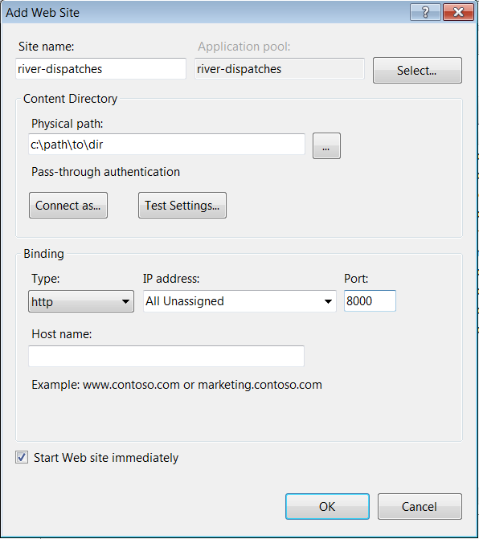

# pwd-river-dispatches
Application developed in partnership with the Fairmount Waterworks, under Azavea's PWD contract. The "Dispatches from the River" exhibit  will introduce users, first, to the concept that the watershed is being monitored through these data points, and, second, to a few key learnings that show how collecting this data has helped us understand and manage our water resources more effectively. This activity will focus on five key measures: temperature, turbidity, salinity, Dissolved Oxygen, and pH.

### Requirements

 * Node v4.5+

### Getting Started

Unzip the original package from PWD into a folder in your system. This can be found at `smb://fileshare.internal.azavea.com/projects/PWD_StormwaterBilling/documents/fairmount_water_works/river_dispatches`. Then run:

```
./scripts/setup $SOURCE_DIR
```

where `$SOURCE_DIR` is the path of the unzipped directory on your local.

#### Development

Run the server using

```
./scripts/server
```

### Ports

| Port | Service |
| --- | --- |
| [9000](http://localhost:9000) | Node Development Server |

### Scripts

| Name | Description |
| --- | --- |
| `server` | Run a node development server |
| `setup` | Install NPM dependencies |


### Making a Release

You can [find the latest version of `git-flow` to install here](https://github.com/petervanderdoes/gitflow-avh). Once it's installed, you'll need to enable `git flow` in the repo by typing `git flow init`. Use the default values provided; `master` is the branch for the current release; `develop` is the branch for the next release.

After you've enabled `git-flow`, you can use the following commands to make a release, replacing "0.1.0" with the version you're releasing and also adding release notes to `CHANGELOG.md`:

```
git flow release start 0.1.0
vim CHANGELOG.md
git add CHANGELOG.md
git commit -m "0.1.0"
git flow release publish 0.1.0
git flow release finish 0.1.0
```

After you've completed the `git flow` steps, you'll need to push the changes back from your local `master` and `develop` branches back to the main repo:

```
git checkout master
git push origin master
git checkout develop
git push origin develop
git push --tags
```

Jenkins will build the release zip file (including assets) under its `pwd-river-dispatches-release` job.

### Installing via IIS
The release zip will contain `web.config` files that instruct IIS v7+ to serve the files for this application.  For a new install, follow these steps:
1. Unzip the release package to a permanent directory on the server
1. Open IIS Management console, and right mouse click on `Sites` -> `Add Web Site`
    1. Give the site name as `river-dispatches` 
    1. Set the `Physical Path` to the directory from Step 1
    1. Set the `Port` to something available on the machine, `8000`
    1. Click ok, and check that http://localhost:8000 serves the app

1. It may be helpful to further make that URL the default home page in Chrome so that it can easily be restarted in the event of a server reboot.
